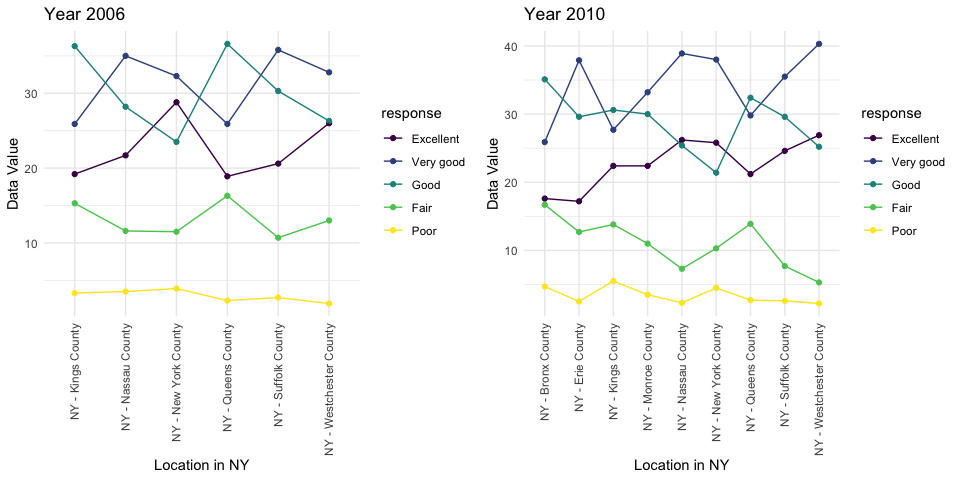
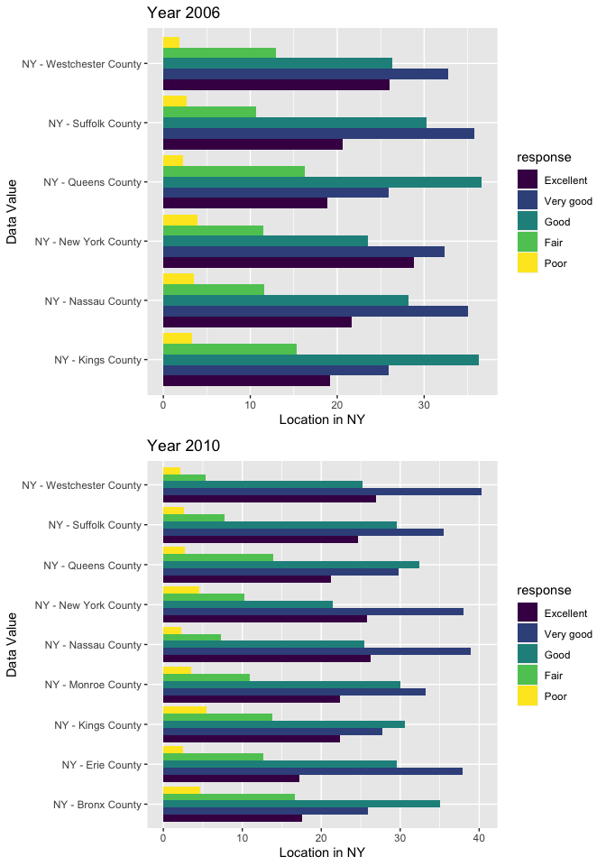

Homework 3
================
Wenxin Tian
2023-10-12

``` r
library(tidyverse)
```

    ## ── Attaching core tidyverse packages ──────────────────────── tidyverse 2.0.0 ──
    ## ✔ dplyr     1.1.3     ✔ readr     2.1.4
    ## ✔ forcats   1.0.0     ✔ stringr   1.5.0
    ## ✔ ggplot2   3.4.3     ✔ tibble    3.2.1
    ## ✔ lubridate 1.9.2     ✔ tidyr     1.3.0
    ## ✔ purrr     1.0.2     
    ## ── Conflicts ────────────────────────────────────────── tidyverse_conflicts() ──
    ## ✖ dplyr::filter() masks stats::filter()
    ## ✖ dplyr::lag()    masks stats::lag()
    ## ℹ Use the conflicted package (<http://conflicted.r-lib.org/>) to force all conflicts to become errors

## Problem 1:

``` r
library(p8105.datasets)
data("instacart")
```

**Dataset description**:

The dataset shows 1384617 observations of 15 variables. Some key
variables include product name and id, which aisle and department it was
bought from, the order in which the item was added to cart, and whether
the item was reordered, meaning it was ordered before by the same
customer. For example, here are the first 5 products listed in the
dataset:

``` r
head(instacart, 5) |>
  knitr::kable()
```

| order_id | product_id | add_to_cart_order | reordered | user_id | eval_set | order_number | order_dow | order_hour_of_day | days_since_prior_order | product_name                                  | aisle_id | department_id | aisle                | department   |
|---------:|-----------:|------------------:|----------:|--------:|:---------|-------------:|----------:|------------------:|-----------------------:|:----------------------------------------------|---------:|--------------:|:---------------------|:-------------|
|        1 |      49302 |                 1 |         1 |  112108 | train    |            4 |         4 |                10 |                      9 | Bulgarian Yogurt                              |      120 |            16 | yogurt               | dairy eggs   |
|        1 |      11109 |                 2 |         1 |  112108 | train    |            4 |         4 |                10 |                      9 | Organic 4% Milk Fat Whole Milk Cottage Cheese |      108 |            16 | other creams cheeses | dairy eggs   |
|        1 |      10246 |                 3 |         0 |  112108 | train    |            4 |         4 |                10 |                      9 | Organic Celery Hearts                         |       83 |             4 | fresh vegetables     | produce      |
|        1 |      49683 |                 4 |         0 |  112108 | train    |            4 |         4 |                10 |                      9 | Cucumber Kirby                                |       83 |             4 | fresh vegetables     | produce      |
|        1 |      43633 |                 5 |         1 |  112108 | train    |            4 |         4 |                10 |                      9 | Lightly Smoked Sardines in Olive Oil          |       95 |            15 | canned meat seafood  | canned goods |

**Questions:**

**1. How many aisles are there, and which aisles are the most items
ordered from?**

``` r
instacart |>
  group_by(aisle) |>
  summarize(count = n()) |>
  arrange(desc(count))
```

    ## # A tibble: 134 × 2
    ##    aisle                          count
    ##    <chr>                          <int>
    ##  1 fresh vegetables              150609
    ##  2 fresh fruits                  150473
    ##  3 packaged vegetables fruits     78493
    ##  4 yogurt                         55240
    ##  5 packaged cheese                41699
    ##  6 water seltzer sparkling water  36617
    ##  7 milk                           32644
    ##  8 chips pretzels                 31269
    ##  9 soy lactosefree                26240
    ## 10 bread                          23635
    ## # ℹ 124 more rows

There are 134 aisles, and the top 5 aisles where the most items are
ordered from are fresh vegetables, fresh fruits, packaged vegetable and
fruits, yogurt, and packaged cheese.

**2. Make a plot that shows the number of items ordered in each aisle,
limiting this to aisles with more than 10000 items ordered. Arrange
aisles sensibly, and organize your plot so others can read it.**

``` r
instacart |>
  group_by(aisle) |>
  summarize(count = n()) |>
  filter(count >= 10000) |>
  arrange(desc(count)) |>
  mutate(aisle = fct_reorder(aisle, count)) |> # had to reorder the aisle factor
  ggplot(
    aes(x = count, y = aisle),
  ) +
  geom_col() +
  labs(
      title = "Popular Aisles",
      x = "Item Count",
      y = "Aisle"
    ) +
  theme_minimal()
```

<!-- -->

**3. Make a table showing the three most popular items in each of the
aisles “baking ingredients”, “dog food care”, and “packaged vegetables
fruits”. Include the number of times each item is ordered in your
table.**

``` r
baking = 
  instacart |>
  filter(aisle == "baking ingredients") |>
  group_by(product_name) |>
  summarize(count = n()) |>
  arrange(desc(count)) |>
  head(3) |>
  mutate(aisle = "Baking Ingredients") |>
  relocate(aisle)

dog_food =
  instacart |>
  filter(aisle == "dog food care") |>
  group_by(product_name) |>
  summarize(count = n()) |>
  arrange(desc(count)) |>
  head(3) |>
  mutate(aisle = "Dog Care and Food") |>
  relocate(aisle)

veg_fruit = 
  instacart |>
  filter(aisle == "packaged vegetables fruits") |>
  group_by(product_name) |>
  summarize(count = n()) |>
  arrange(desc(count)) |>
  head(3) |>
  mutate(aisle = "Packaged Vegetable and Fruits") |>
  relocate(aisle)

knitr::kable(
  list(baking, dog_food, veg_fruit),
  caption = "Most Popular Items in Following Aisles"
)
```

<table class="kable_wrapper">
<caption>
Most Popular Items in Following Aisles
</caption>
<tbody>
<tr>
<td>

| aisle              | product_name      | count |
|:-------------------|:------------------|------:|
| Baking Ingredients | Light Brown Sugar |   499 |
| Baking Ingredients | Pure Baking Soda  |   387 |
| Baking Ingredients | Cane Sugar        |   336 |

</td>
<td>

| aisle             | product_name                                  | count |
|:------------------|:----------------------------------------------|------:|
| Dog Care and Food | Snack Sticks Chicken & Rice Recipe Dog Treats |    30 |
| Dog Care and Food | Organix Chicken & Brown Rice Recipe           |    28 |
| Dog Care and Food | Small Dog Biscuits                            |    26 |

</td>
<td>

| aisle                         | product_name         | count |
|:------------------------------|:---------------------|------:|
| Packaged Vegetable and Fruits | Organic Baby Spinach |  9784 |
| Packaged Vegetable and Fruits | Organic Raspberries  |  5546 |
| Packaged Vegetable and Fruits | Organic Blueberries  |  4966 |

</td>
</tr>
</tbody>
</table>

``` r
# Simpler way:

instacart |>
  group_by(aisle, product_name) |>
  filter(
    aisle %in% c("baking ingredients", "dog food care", "packaged vegetables fruits")
    ) |>
  summarize(count = n()) |> 
  arrange(desc(count)) |>
  slice(1:3) |>
  knitr::kable(caption = "Most Popular Items in Following Aisles")
```

    ## `summarise()` has grouped output by 'aisle'. You can override using the
    ## `.groups` argument.

| aisle                      | product_name                                  | count |
|:---------------------------|:----------------------------------------------|------:|
| baking ingredients         | Light Brown Sugar                             |   499 |
| baking ingredients         | Pure Baking Soda                              |   387 |
| baking ingredients         | Cane Sugar                                    |   336 |
| dog food care              | Snack Sticks Chicken & Rice Recipe Dog Treats |    30 |
| dog food care              | Organix Chicken & Brown Rice Recipe           |    28 |
| dog food care              | Small Dog Biscuits                            |    26 |
| packaged vegetables fruits | Organic Baby Spinach                          |  9784 |
| packaged vegetables fruits | Organic Raspberries                           |  5546 |
| packaged vegetables fruits | Organic Blueberries                           |  4966 |

Most Popular Items in Following Aisles

**4. Make a table showing the mean hour of the day at which Pink Lady
Apples and Coffee Ice Cream are ordered on each day of the week; format
this table for human readers (i.e. produce a 2 x 7 table).**

``` r
instacart |>
  group_by(product_name, order_dow) |>
  summarize(mean_hour = mean(order_hour_of_day)) |>
  filter(product_name %in% c("Pink Lady Apples", "Coffee Ice Cream")) |>
  pivot_wider(
    names_from = order_dow,
    values_from = mean_hour
  ) |>
  rename(
    "Sunday" = "0",
    "Monday" = "1",
    "Tuesday" = "2",
    "Wednesday" = "3",
    "Thursday" = "4",
    "Friday" = "5",
    "Saturaday" = "6"
  ) |>
  knitr::kable(
    caption = "Mean Hour of Day at Which Following Products are Ordered:"
  )
```

    ## `summarise()` has grouped output by 'product_name'. You can override using the
    ## `.groups` argument.

| product_name     |   Sunday |   Monday |  Tuesday | Wednesday | Thursday |   Friday | Saturaday |
|:-----------------|---------:|---------:|---------:|----------:|---------:|---------:|----------:|
| Coffee Ice Cream | 13.77419 | 14.31579 | 15.38095 |  15.31818 | 15.21739 | 12.26316 |  13.83333 |
| Pink Lady Apples | 13.44118 | 11.36000 | 11.70213 |  14.25000 | 11.55172 | 12.78431 |  11.93750 |

Mean Hour of Day at Which Following Products are Ordered:

## Problem 2:

``` r
library(p8105.datasets)
data("brfss_smart2010")
```

**1. Data Cleaning:**

- format the data to use appropriate variable names;
- focus on the “Overall Health” topic
- include only responses from “Excellent” to “Poor”
- organize responses as a factor taking levels ordered from “Poor” to
  “Excellent”

``` r
brf = 
  brfss_smart2010 |>
  janitor::clean_names() |>
  rename(
    "state" = locationabbr,
    "location" = locationdesc) |>
  filter(
    topic == "Overall Health",
    response %in% c("Excellent", "Very good", "Good", "Fair", "Poor")
  ) |>
  mutate(response = ordered(response, levels = c("Excellent", "Very good", "Good", "Fair", "Poor")))
```

**2. In 2002, which states were observed at 7 or more locations? What
about in 2010?**

``` r
states_2002 =
  brf |>
  group_by(year, state, location) |>
  summarize() |>
  count(state) |>
  filter(
    year == 2002,
    n >= 7
  ) |>
  pull(state)
```

    ## `summarise()` has grouped output by 'year', 'state'. You can override using the
    ## `.groups` argument.

``` r
states_2010 =
  brf |>
  group_by(year, state, location) |>
  summarize() |>
  count(state) |>
  filter(
    year == 2010,
    n >= 7
  ) |>
  pull(state)
```

    ## `summarise()` has grouped output by 'year', 'state'. You can override using the
    ## `.groups` argument.

In 2002, the states that were observed in more than 7 places are CT, FL,
MA, NC, NJ, PA. In 2010, the list changed to CA, CO, FL, MA, MD, NC, NE,
NJ, NY, OH, PA, SC, TX, WA.

**3. Construct a dataset that is limited to Excellent responses, and
contains, year, state, and a variable that averages the `data_value`
across locations within a state. Make a “spaghetti” plot of this average
value over time within a state (that is, make a plot showing a line for
each state across years – the geom_line geometry and group aesthetic
will help).**

``` r
brf |>
  filter(response == "Excellent") |>
  group_by(year, state) |>
  summarize(
    mean_value = mean(data_value)
  ) |>
  ggplot(aes(x = year, y = mean_value, group = state, color = state)) +
  geom_point() +
  geom_line() +
  labs(
    title = "Mean Data Value Of Each State Over Time",
    x = "Year",
    y = "Mean Data Value"
  )
```

    ## `summarise()` has grouped output by 'year'. You can override using the
    ## `.groups` argument.

    ## Warning: Removed 4 rows containing missing values (`geom_point()`).

    ## Warning: Removed 3 rows containing missing values (`geom_line()`).

<!-- -->

Different states are grouped and colored. The plot shows averaged
`data_value` of all states from year 2002 to 2010.

**4. Make a two-panel plot showing, for the years 2006, and 2010,
distribution of data_value for responses (“Poor” to “Excellent”) among
locations in NY State.**

``` r
q4_2006 =
  brf |>
  filter(
    year == 2006,
    state == "NY"
  ) |>
  ggplot(aes(location, data_value, group = response, color = response)) +
  geom_point() +
  geom_line() +
  theme_minimal() +
  scale_x_discrete(guide = guide_axis(angle = 90)) +
  labs(title = "Year 2006", x = "Location in NY", y = "Data Value")


q4_2010 =
  brf |>
  filter(
    year == 2010,
    state == "NY"
  ) |>
  ggplot(aes(location, data_value, group = response, color = response)) +
  geom_point() +
  geom_line() +
  theme_minimal() +
  scale_x_discrete(guide = guide_axis(angle = 90)) +
  labs(title = "Year 2010", x = "Location in NY", y = "Data Value")

gridExtra::grid.arrange(q4_2006, q4_2010, ncol = 2)
```

<!-- -->

``` r
q4_2006 =
  brf |>
  filter(
    year == 2006,
    state == "NY"
  ) |>
  ggplot(aes(x = data_value, y = location, fill = response)) +
  geom_col(position = "dodge") +
  labs(title = "Year 2006", x = "Location in NY", y = "Data Value") +
  theme(legend.position = "right")


q4_2010 =
  brf |>
  filter(
    year == 2010,
    state == "NY"
  ) |>
  ggplot(aes(x = data_value, y = location, fill = response)) +
  geom_col(position = "dodge") +
  labs(title = "Year 2010", x = "Location in NY", y = "Data Value") +
  theme(legend.position = "right")

gridExtra::grid.arrange(q4_2006, q4_2010, nrow = 2)
```

<!-- -->

In order to show the data value of responses through counties in NY in 2
different years, I included both scatter plots and bar plots. In both of
them, different responses are colored differently, and the plot shows
relationship of data value against locations. In
